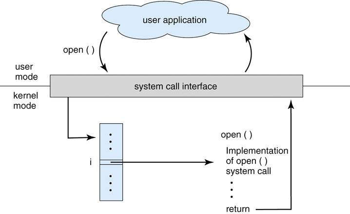

# OS의 일반적인 작동 원리

## OS(operating system)
- computer hardware(CPU, I/O)를 관리해주면서 동시에 여러 application들이 작동할 수 있는 환경을 제공해주는 software


## OS의 역할
- 프로그램들이 자원을 필요로 할 때 ```자원을 할당```
  - CPU 시간
  - 메모리 공간
  - 파일 저장 공간
  - 입출력장치

- 각각 자원을 할당받은 프로그램들이 서로의 영역을 침범하지 않게 하고, 컴퓨터의 부적절한 사용을 방지하는 ```제어프로그램의 역할```


## OS의 구조
### 1. Multiprogramming
- 여러 작업들이 동시에 메모리에 올라가게 됨
- ```두 개의 작업```을 수행할 때  ```작업1```이 CPU를 사용한 후 I/O를 수행할 때  ```작업2```는 대기중인 CPU를 사용함으로 유연성을 제공하여 효율성을 높임
- ```Job Scheduling```을 통해 어떤 작업들이 메모리에 올라갈지 결정
  - Scheduling : 자원을 효율적으로 할당하기 위한 알고리즘


### 2. Multitasking
- 각각의 작업에 시간을 부여하고 CPU작업을 하다가 시간이 지나가면 다른 작업에게 CPU 자원을 할당
- ```CPU Scheduling```을 통해 어떤 작업들을 CPU에서 수행할지 결정
- ```swapping```을 통한 프로세스 교체
  - Swapping : 주기억장치에 적재한 하나의 프로세스와 보조기억장치에 적재한 다른 프로세스의 메모리를 교체하는 기법

## OS의 작동원리
### interrupt-driven
- H/W interrupts
  - 기계검사 인터럽트
  - 외부 인터럽트
  - 입출력 인터럽트
  - 프로그램검사 인터럽트

- S/W interrupts - trap(or exception)
  - S/W errors : 프로그래밍하면서 나올 수 있는 error ```(stack overflows, 0으로 나누는 연산 등등..)```
  - 운영체제 services들에 대한 요청 : ```System Call```


#### Dual-Mode Execution
- ```Mode-Bit```가 하드웨어에 의해 제공
  - 특권 명령 지정은 오직 커널모드에서만 실행 가능
	- 사용자 모드에서 운영체제로부터 서비스를 요청(System call)을 하게되면 모드를 커널모드로 변경시킨다
- Kernel Mode & User Mode
- 예시
```
printf("Hello World"); 
```
<br>
<p align="center"></p>

- ```System-Call```이 일어나게 되면 해당 시스템 콜에 대한 번호를 ```Table```에서 찾아 ```Loutine```을 실행

#### Timer
- ```Infinite Loop```나 ```Resouce의 독점```을 막음
- 특정 시간이 지나면 interrupt를 발생시키고 OS는 그 시간을 감소시키면서 interrupt를 기다림
- OS는 Timer가 끝난 작업을 종료시키고 실행되기 전 Scheduling 작업 전에 Timer를 작동시킴
